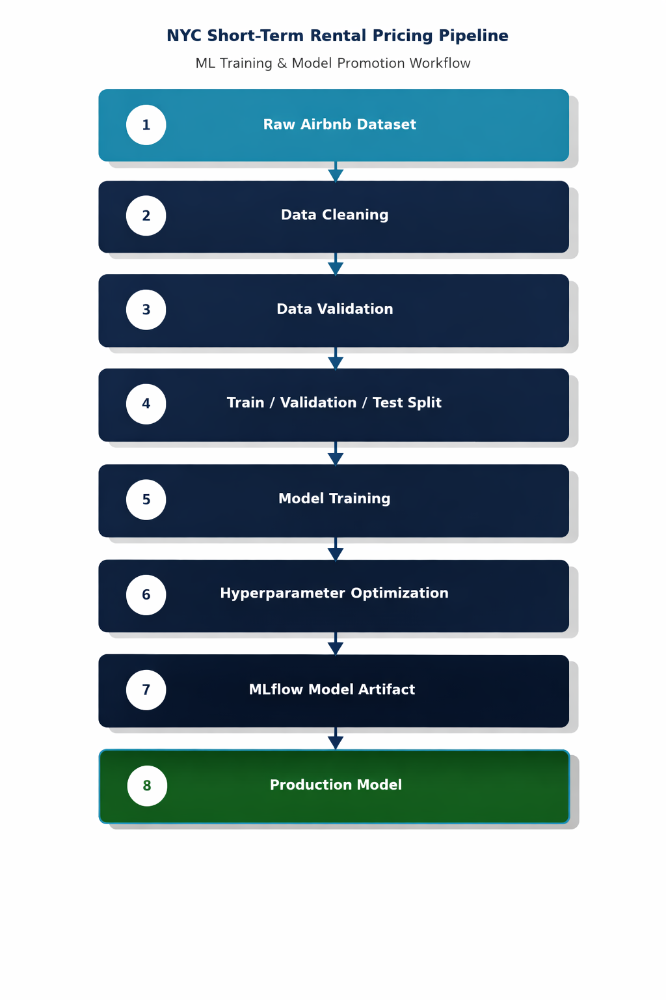
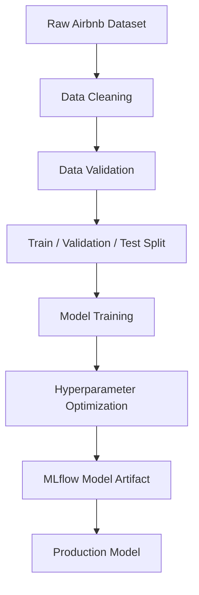

# NYC Short-Term Rental Pricing Pipeline

A production-style machine learning pipeline that trains and retrains a pricing model for short-term rental listings in New York City. The system ingests weekly batch data, validates and cleans it, performs feature filtering for geographic and price constraints, trains and tunes a model, and publishes a versioned "production" model artifact for downstream consumption.

This project emphasizes repeatability, experiment tracking, and reliable model promotion rather than one-off modeling work.

---

## Why This Project

Many machine learning models never make it beyond notebooks. This project focuses on building the infrastructure around the model — automated retraining, data validation gates, experiment tracking, and a promotion mechanism that mirrors how ML systems are managed in production environments.

The goal was to engineer a pipeline that could be handed off, scheduled, and rerun reliably — not just a model that works once.

---

## Problem

Property management teams need consistent, data-driven pricing estimates for new and existing listings. Rental marketplaces change quickly, and new bulk data arrives regularly, meaning pricing models can drift and require routine retraining.

Without an automated pipeline, retraining becomes manual, error-prone, and difficult to reproduce — especially when tracking experiments, data versions, and model lineage.

---

## Solution

This repository implements an end-to-end ML training pipeline that can be executed on demand or on a schedule (e.g., weekly). The pipeline:

- Ingests raw listing data in batch form
- Applies repeatable cleaning and validation rules
- Splits data into train/validation/test sets
- Trains a baseline model and runs hyperparameter optimization
- Registers and versions model artifacts
- Promotes a selected model to a `prod` stage/tag for deployment workflows

The result is a repeatable training system that produces traceable, versioned models and metrics.

---

## System Architecture





### Key Components

| Component | Description |
|---|---|
| **Pipeline Orchestrator** | Runs pipeline steps end-to-end or as selected stages |
| **Data Quality Layer** | Validation tests and deterministic cleaning rules |
| **Training & Tuning** | Random Forest baseline plus hyperparameter search |
| **Model Registry / Artifacts** | Versioned exports and production tagging |
| **Experiment Tracking** | Metrics and lineage captured for reproducibility |

---

## Project Structure

```
nyc-rental-price-prediction-pipeline/
├── components/         # Reusable ML pipeline components
├── src/                # Pipeline orchestration and logic
├── images/             # Documentation diagrams
├── MLproject           # MLflow pipeline configuration
├── main.py             # Pipeline entry point
├── config.yaml         # Pipeline configuration (Hydra)
├── rf_config.json      # Model hyperparameters
├── conda.yml           # MLflow runtime environment
└── environment.yml     # Development environment
```

---

## Technologies Used

- Python
- MLflow *(pipeline execution + model packaging/versioning)*
- Weights & Biases *(experiment tracking)*
- Hydra *(configuration management)*
- Pandas / Scikit-learn
- Random Forest Regressor
- Data validation tests

---

## Example Usage

**Run the full pipeline:**

```bash
mlflow run .
```

**Run specific steps (during development):**

```bash
mlflow run . -P steps=download,basic_cleaning
```

**Override configuration at runtime:**

```bash
mlflow run . \
  -P steps=download,basic_cleaning \
  -P hydra_options="modeling.random_forest.n_estimators=200 etl.min_price=50"
```

---

## Key Features

- Repeatable end-to-end training workflow (batch retraining ready)
- Configuration-driven pipeline (no hardcoded parameters)
- Data cleaning and validation gates before training
- Geographic boundary filtering for NYC listings
- Train/validation/test split for reliable evaluation
- Hyperparameter optimization to improve model performance
- Versioned model artifacts with a production promotion mechanism (`prod` tag)

---

## Outputs

The pipeline produces:

- Cleaned and filtered datasets (intermediate artifacts)
- Train/validation/test splits
- Model metrics (tracked per run)
- Versioned model artifacts (exported via MLflow)
- A promoted "production" model tagged as `prod`

---

## Future Improvements

- Add a scheduled retraining workflow (Prefect/Airflow/cron) with notifications
- Introduce model performance monitoring and drift detection
- Add feature store integration for consistent feature computation
- Containerize pipeline execution for environment parity (Docker)
- Add CI checks for data validation + pipeline smoke tests
- Add a lightweight inference API or batch scoring job to complete the MLOps loop

---

## Release Notes

The current stable release includes:

- Deterministic cleaning and filtering
- Geographic boundary filtering for NYC longitude/latitude ranges
- Data validation tests
- Train/validation/test split
- Random Forest training
- Hyperparameter optimization
- Model export and versioning via MLflow
- Production model tagging (`prod`)
